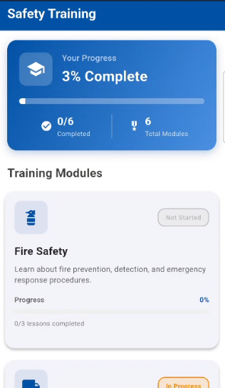

# JYSK Safety App

Welcome to the **JYSK Safety App**, a comprehensive mobile solution designed to enhance workplace safety through education, gamification, and real-time information. This application serves as a central hub for JYSK employees to learn about safety protocols, participate in training modules, and track their progress.

## 🚀 Introduction

The JYSK Safety App is built to ensure every employee is well-versed in safety procedures. It transforms traditional safety training into an engaging experience with:
- **Interactive Learning Modules**: Deep dives into Fire Safety, Equipment Handling, and First Aid.
- **Gamified Quizzes**: Test your knowledge and earn scores.
- **Leaderboard**: Compete with colleagues and see who leads in safety knowledge.
- **Resource Center**: Quick access to vital safety documentation and videos.

## 🏗 Architecture

The application is developed using the **Flutter** framework, providing a high-performance, cross-platform experience.

### Folder Structure
- `lib/entities`: Data models for Modules, Quizzes, Questions, and Users.
- `lib/screens`: UI components for different app views (Safety Tab, Leaderboards, Quizzes, etc.).
- `lib/services`: Business logic and data management (e.g., `SafetyDataService`).
- `lib/widgets`: Reusable UI components.

### Key Components
- **Main Navigation**: A centralized navigation system handling transitions between Safety, Leaderboard, and Settings.
- **Data Layer**: A singleton service (`SafetyDataService`) that manages mock and persistent safety data.
- **State Management**: Efficient use of Flutter's stateful widgets and animations to provide a smooth user experience.

## 🛠 Installation Guide

### Prerequisites
- [Flutter SDK](https://docs.flutter.dev/get-started/install) (version ^3.8.1)
- [Dart SDK](https://dart.dev/get-started)
- Android Studio / VS Code with Flutter extensions
- A mobile emulator or physical device

### Steps to Run
1. **Clone the repository**:
   ```bash
   git clone <repository-url>
   cd JYSK/frontend
   ```

2. **Install dependencies**:
   ```bash
   flutter pub get
   ```

3. **Run the application**:
   ```bash
   flutter run
   ```

## ✨ Features

- **Personalized Dashboard**: View your current safety status and progress.
- **Comprehensive Modules**:
  - 🔥 **Fire Safety**: Prevention, evacuation, and extinguisher types.
  - 🚜 **Equipment Safety**: Forklift operation and heavy machinery handling.
  - 🚑 **First Aid**: Basic emergency response and CPR.
- **Quiz System**: Instant feedback on safety knowledge with passing score requirements.
- **Reward System**: Celebrate quiz completions with confetti animations and progress updates.

## 📺 Documentation & Screenshots

### Application Screenshots
Explore the visual interface of the JYSK Safety App:

| Dashboard | Module Progress | JYSK Feed |
| :---: | :---: | :---: |
|  |  |  |
| **Dashboard**: Overview of overall training progress and available modules. | **Module Details**: Breakdown of individual lessons and progress tracking within a module. | **JYSK Feed**: Internal communication hub for team updates and interactive polls. |

### Videos
For a better understanding of the application's flow and features, please refer to the following demonstration videos:

#### MAC1 - App Overview
Experience the core navigation and dashboard features.

[](docs/MAC1.mp4)

#### MAC2 - Learning & Quizzes
See the interactive safety modules and quiz system in action.

[](docs/MAC2.mp4)

---
*Developed for JYSK to ensure a safer workplace for everyone.*
